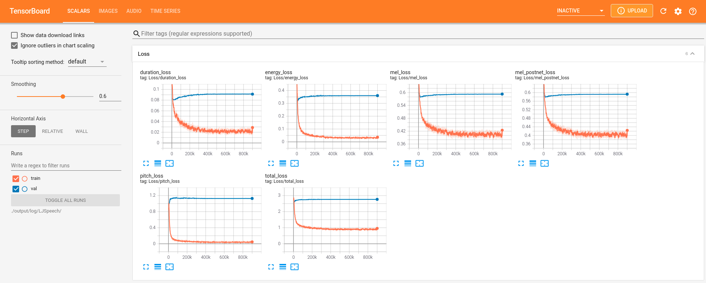
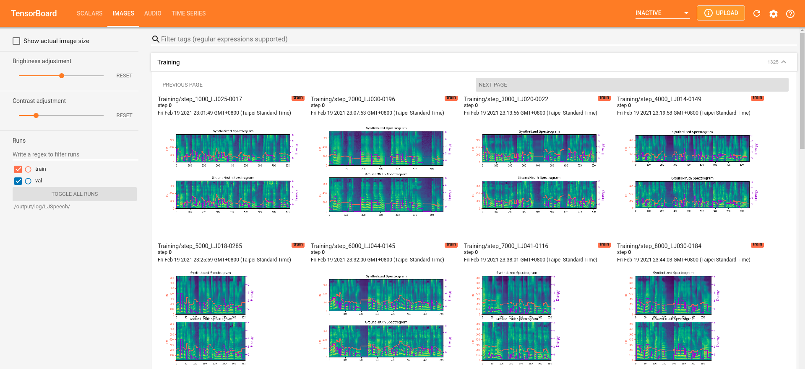
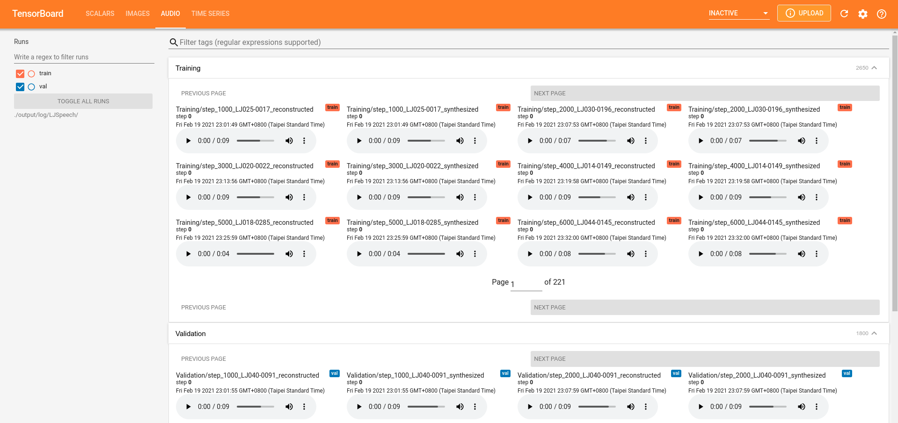

# FastSpeech 2 - PyTorch Implementation

This is a PyTorch implementation of Microsoft's text-to-speech system [**FastSpeech 2: Fast and High-Quality End-to-End Text to Speech**](https://arxiv.org/abs/2006.04558v1). 
This project is based on [xcmyz's implementation](https://github.com/xcmyz/FastSpeech) of FastSpeech. Feel free to use/modify the code.

There are several versions of FastSpeech 2.
This implementation is more similar to [version 1](https://arxiv.org/abs/2006.04558v1), which uses F0 values as the pitch features.
On the other hand, pitch spectrograms extracted by continuous wavelet transform are used as the pitch features in the [later versions](https://arxiv.org/abs/2006.04558).


# Updates
- 2021/7/8: Release the checkpoint and audio samples of a multi-speaker English TTS model trained on LibriTTS
- 2021/2/26: Support English and Mandarin TTS
- 2021/2/26: Support multi-speaker TTS (AISHELL-3 and LibriTTS)
- 2021/2/26: Support MelGAN and HiFi-GAN vocoder

# Audio Samples
Audio samples generated by this implementation can be found [here](https://ming024.github.io/FastSpeech2/). 

# Quickstart

## Dependencies
You can install the Python dependencies with
```
pip3 install -r requirements.txt
```
then
```commandline
conda install conda-forge::pyworld
```

## Inference

You have to download the [pretrained models](https://drive.google.com/drive/folders/1DOhZGlTLMbbAAFZmZGDdc77kz1PloS7F?usp=sharing) and put them in ``output/ckpt/LJSpeech/``,  ``output/ckpt/AISHELL3``, or ``output/ckpt/LibriTTS/``.

For English single-speaker TTS, run
```
python3 synthesize.py --text "YOUR_DESIRED_TEXT" --restore_step 900000 --mode single -p config/LJSpeech/preprocess.yaml -m config/LJSpeech/model.yaml -t config/LJSpeech/train.yaml
```

For Mandarin multi-speaker TTS, try
```
python3 synthesize.py --text "大家好" --speaker_id SPEAKER_ID --restore_step 600000 --mode single -p config/AISHELL3/preprocess.yaml -m config/AISHELL3/model.yaml -t config/AISHELL3/train.yaml
```

For English multi-speaker TTS, run
```
python3 synthesize.py --text "YOUR_DESIRED_TEXT"  --speaker_id SPEAKER_ID --restore_step 800000 --mode single -p config/LibriTTS/preprocess.yaml -m config/LibriTTS/model.yaml -t config/LibriTTS/train.yaml
```

The generated utterances will be put in ``output/result/``.

To copy from remote server back to local machine:
```commandline
scp "ditto@136.36.160.77:/home/ditto/Documents/ProsodyCloning/FastSpeech2/output/result/LJSpeech/<name of file>" /Users/bryantmcarthur/Downloads/
scp "ditto@136.36.160.77:/home/ditto/Documents/ProsodyCloning/FastSpeech2/output/result/LJSpeech/Hi my name is ditto and this is what I sound like.wav" /Users/bryantmcarthur/Downloads/
```

Here is an example of synthesized mel-spectrogram of the sentence "Printing, in the only sense with which we are at present concerned, differs from most if not from all the arts and crafts represented in the Exhibition", with the English single-speaker TTS model.  


## Batch Inference
Batch inference is also supported, try

```
python3 synthesize.py --source preprocessed_data/LJSpeech/val.txt --restore_step 900000 --mode batch -p config/LJSpeech/preprocess.yaml -m config/LJSpeech/model.yaml -t config/LJSpeech/train.yaml
```
to synthesize all utterances in ``preprocessed_data/LJSpeech/val.txt``

## Controllability
The pitch/volume/speaking rate of the synthesized utterances can be controlled by specifying the desired pitch/energy/duration ratios.
For example, one can increase the speaking rate by 20 % and decrease the volume by 20 % by

```
python3 synthesize.py --text "YOUR_DESIRED_TEXT" --restore_step 900000 --mode single -p config/LJSpeech/preprocess.yaml -m config/LJSpeech/model.yaml -t config/LJSpeech/train.yaml --duration_control 0.8 --energy_control 0.8
```

```
python3 synthesize.py --text "Hi my name is Ditto and this is my voice" --restore_step 900000 --mode single -p config/LJSpeech/preprocess.yaml -m config/LJSpeech/model.yaml -t config/LJSpeech/train.yaml --duration_control .8 --energy_control .8
```

# Training

## Datasets

The supported datasets are

- [LJSpeech](https://keithito.com/LJ-Speech-Dataset/): a single-speaker English dataset consists of 13100 short audio clips of a female speaker reading passages from 7 non-fiction books, approximately 24 hours in total.

```wget https://data.keithito.com/data/speech/LJSpeech-1.1.tar.bz2```

- [AISHELL-3](http://www.aishelltech.com/aishell_3): a Mandarin TTS dataset with 218 male and female speakers, roughly 85 hours in total.
- [LibriTTS](https://research.google/tools/datasets/libri-tts/): a multi-speaker English dataset containing 585 hours of speech by 2456 speakers.

We take LJSpeech as an example hereafter.

## Preprocessing
 
### Prepare Align
First, we need to take the metadata csv files that contain the fileID, transcription as well as the 
.wav file of the audio and translate the text to our tgt language to train on (if translation doesn't already exist) and
resave the transcription and translation as a .lab file and copy over the .wav file in order to create the TextGrid files.

We also perform a word alignment on the transcription and translation and save it separately to be used later.

run 
```
python3 prepare_align.py config/LJSpeech/preprocess.yaml
```
```
nohup python3 prepare_align.py config/LJSpeech/preprocess.yaml &

ps -ef | grep 89466
```

### Get the TextGrid Files
As described in the paper, [Montreal Forced Aligner](https://montreal-forced-aligner.readthedocs.io/en/latest/) (MFA) is used to obtain the alignments between the utterances and the phoneme sequences.
Alignments of the supported datasets are provided [here](https://drive.google.com/drive/folders/1DBRkALpPd6FL9gjHMmMEdHODmkgNIIK4?usp=sharing).

```
wget --no-check-certificate 'https://drive.google.com/uc?export=download&id=1ukb8o-SnqhXCxq7drI3zye3tZdrGvQDA' -O preprocessed_data/LJSpeech/LJSpeech.zip
```
or copy the file to the server by
```
scp /Users/bryantmcarthur/Downloads/LJSpeech.zip ditto@136.36.160.77:/home/ditto/Documents/ProsodyCloning/FastSpeech2/preprocessed_data/LJSpeech
scp /Users/bryantmcarthur/Downloads/LJSpeech.zip ditto@Emotiv:/home/ditto/Ditto/FastSpeech2/preprocessed_data/LJSpeech
```
You have to unzip the files in ``preprocessed_data/LJSpeech/TextGrid/``.

```unzip preprocessed_data/LJSpeech/LJSpeech.zip -d preprocessed_data/LJSpeech/```


Alternately, you can align the corpus by yourself to get the TextGrid Files. 
Download the official MFA package and run
```
./montreal-forced-aligner/bin/mfa_align raw_data/LJSpeech/ lexicon/librispeech-lexicon.txt english preprocessed_data/LJSpeech
```

```
./montreal-forced-aligner/bin/mfa_align raw_data/Bryant/ lexicon/librispeech-lexicon.txt english preprocessed_data/Bryant
```
or
```
./montreal-forced-aligner/bin/mfa_train_and_align raw_data/LJSpeech/ lexicon/librispeech-lexicon.txt preprocessed_data/LJSpeech
```

to align the corpus.

### Preprocessing Script

After that, run the preprocessing script by
```
python3 preprocess.py config/LJSpeech/preprocess.yaml
```
```
python3 preprocess.py config/Bryant/preprocess.yaml
```
```
nohup python3 preprocess.py config/LJSpeech/preprocess.yaml &
ps -ef | grep 399229
```


## PreTrain
Pretrain is especially for the Prosody Extractor and Predictor, but will also update synthesizer weights (Encoder, Adapter, Decoder).
```
python3 pretrain.py -p config/LJSpeech/preprocess.yaml -m config/LJSpeech/model.yaml -t config/LJSpeech/train.yaml
```

## Train Synthesizer
Train your model with
```
python3 train.py -p config/LJSpeech/preprocess.yaml -m config/LJSpeech/model.yaml -t config/LJSpeech/train.yaml
```
```
python3 train.py -p config/Bryant/preprocess.yaml -m config/Bryant/model.yaml -t config/Bryant/train.yaml
```

The model takes less than 10k steps (less than 1 hour on my GTX1080Ti GPU) of training to generate audio samples with acceptable quality, which is much more efficient than the autoregressive models such as Tacotron2.

# TensorBoard

To transfer to local port when you ssh
```
ssh -L 6006:127.0.0.1:6006 ditto@136.36.160.77
```

Use to view locally
```
tensorboard --logdir output/log/LJSpeech
```

or to transfer from the server
```commandline
tensorboard --logdir=output/log/LJSpeech --bind_all
```
Then on local machine go to http://127.0.0.1:6006.


The loss curves, synthesized mel-spectrograms, and audios are shown.





# Implementation Issues

If you get a `segmentation fault` then in your command line first `export LD_LIBRARY_PATH=""`

- Following [xcmyz's implementation](https://github.com/xcmyz/FastSpeech), I use an additional Tacotron-2-styled Post-Net after the decoder, which is not used in the original FastSpeech 2.
- Gradient clipping is used in the training.
- In my experience, using phoneme-level pitch and energy prediction instead of frame-level prediction results in much better prosody, and normalizing the pitch and energy features also helps. Please refer to ``config/README.md`` for more details.

Please inform me if you find any mistakes in this repo, or any useful tips to train the FastSpeech 2 model.

# References
- [FastSpeech 2: Fast and High-Quality End-to-End Text to Speech](https://arxiv.org/abs/2006.04558), Y. Ren, *et al*.
- [xcmyz's FastSpeech implementation](https://github.com/xcmyz/FastSpeech)
- [TensorSpeech's FastSpeech 2 implementation](https://github.com/TensorSpeech/TensorflowTTS)
- [rishikksh20's FastSpeech 2 implementation](https://github.com/rishikksh20/FastSpeech2)

# Citation
```
@INPROCEEDINGS{chien2021investigating,
  author={Chien, Chung-Ming and Lin, Jheng-Hao and Huang, Chien-yu and Hsu, Po-chun and Lee, Hung-yi},
  booktitle={ICASSP 2021 - 2021 IEEE International Conference on Acoustics, Speech and Signal Processing (ICASSP)}, 
  title={Investigating on Incorporating Pretrained and Learnable Speaker Representations for Multi-Speaker Multi-Style Text-to-Speech}, 
  year={2021},
  volume={},
  number={},
  pages={8588-8592},
  doi={10.1109/ICASSP39728.2021.9413880}}
```
